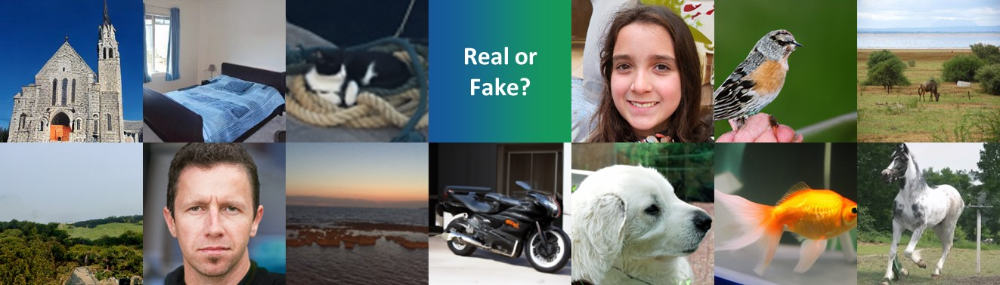

This year the VIP Cup competition @ICIP2022 is organized by University Federico II of Naples and NVIDIA.
The aim is to distinguish real versus AI-based content in images.
Teams are requested to design a strategy for synthetic image detection by relying on image processing and machine learning techniques.

### Background

In recent years there have been astonishing advances in AI-based synthetic media generation. 
Thanks to deep learning methods it is now possible to generate visual data with a high level of realism. 
Although this opens up a large number of new opportunities, it also undermines the trustworthiness of media content and supports the spread of misinformation over the internet.
Two recent studies [1,2] have independently proved that humans cannot reliably tell apart images generated by advanced GAN technologies, 
such as StyleGAN2 [3], from pristine images. 
This raises legitimate concerns about the use of synthetic images for the most different purposes. 
In this context, there is a fundamental need to develop robust and automatic tools capable of distinguishing synthetic images from real ones. 

In the literature, there has been an intense research effort for reliable synthetic image detectors,
and many of them have shown impressively good results when suitably trained [4]. 
However, one of the main challenges in GAN image detection is generalization. 
In fact, if a detector is tested on the very same type of images seen in the training phase it will hardly fail. 
Unfortunately, this is not what happens in a realistic scenario, in fact new architectures 
and different ways of generating synthetic data are proposed with the evolution of technology [5,6]. 
To operate successfully in the wild [7,8], a detector should i) be robust to image impairments, 
ii) work universally well across sources and iii) generalize well to new sources. 
Robustness to image impairments is essential, since most social networks resize and compress images to satisfy their internal constraints. 
These non-malicious operations destroy precious evidence, with a possible detrimental effect on detection performance. 
Universality is also a fundamental requirement, since the detector ignores the image source 
(which GAN architecture was used to generate it) and cannot use this information. 
Finally, the image under test may have been generated by a totally new architecture, 
and the detector should work well also in this condition.

### Challenge Organization

Competitors are asked to work in the challenging scenario where it is not known the method used to generate synthetic data.
More specifically the test data comprises: 
* both fully synthetic images and partially manipulated ones, 
* generative models that include not only GANs, but also more recent diffusion-based models. 

Being able to discriminate synthetic images, fully and partially synthetic, 
vs pristine ones can represent a step forward to the advancement of forensics tools.

The challenge will consist of two stages: an open competition that any eligible team can participate in, 
and an invitation-only final competition. Eligible teams must submit their entries by **September 5, 2022**. 
The three teams with the highest performance will be selected by **September 10, 2022** and invited to join the final competition. 
The final competition will be judged at ICIP 2022, which will be held on **October 16-19, 2022**.

General information and resources are available on the [page web](https://grip-unina.github.io/vipcup2022/) and [Piazza class](https://piazza.com/university_of_naples_federico_ii/summer2022/vipcup2022).

To set up a free account, use the access code "vipcup2022" to join as a student the "VIPCUP 2022: IEEE Video and Image Processing Cup" class.

<b>IMPORTANT:</b> Registration is needed at https://www2.securecms.com/VIPCup/VIPRegistration.asp within August 8.

#### Open Competition: Part 1
Part 1 of the open competition is designed to give teams a simplified version of the problem at hand to become familiar with the task. 
Synthetic images can be fully or partially synthetic. 
Teams are requested to provide the executable code to the organizers in order to test the algorithms on the evaluation dataset (Test-set 1).
The synthetic images included in Test-set 1 are generated using five known techniques, while generated models used in Test-set 2 are unknown.
The five techniques used for synthetic image generation (Test-set 1) are:
1. StyleGAN2 (https://github.com/NVlabs/stylegan2  )
2. StyleGAN3 (https://github.com/NVlabs/stylegan3  )
3. Inpainting with Gated Convolution (https://github.com/JiahuiYu/generative_inpainting ) 
4. GLIDE for inpainting and image generation from text (https://github.com/openai/glide-text2im )
5. Taming Transformers  for unconditional image generation, class-conditional image generation and image generation from segmentation maps (https://github.com/CompVis/taming-transformers )

All the images of the test data are randomly cropped and resized to 200x200 pixels and then compressed using JPEG at different quality levels.
Teams will be provided with PYTHON scripts to apply these operations to the training dataset. 

#### Open Competition: Part 2
Part 2 of the competition is designed to address a more challenging task: synthetic image detection on unseen models, 
i.e. synthetic data generated using architectures not present in training. The task remains the same as for Part 1. 
Teams are requested to provide the executable code to the organizers in order to test the algorithms on the evaluation dataset (Test-set 2).

#### Final Competition
The three highest scoring teams from the open competition will be selected
and they can provide an additional submission.

#### Training
Synthetic training images can be download from the links available on piazza: StyleGAN2, StyleGAN3, Inpainting with Gated Convolution, GLIDE, Taming Transformers.
For real training images, teams can rely on public datasets, such as COCO, LSUN, ImageNet, FFHQ.

Teams may use data, other than the competition data, provided the team has the right and authority to use such external data for the purposes of the competition. 
The same holds for pre-trained models.

### Challenge Evaluation Criteria
Results will be judged for Part 1 and Part 2 by means of balanced accuracy for the detection task.
The final ranking score will be the weighted average between the accuracy obtained in Part 1 and Part 2 computed as

     Score = ( 0.7 × Accuracy_Part_1) + ( 0.3 × Accuracy_Part_2)

### Submission Information

The evaluation datasets (Test-set 1 and Test-set 2) will not be provided. Teams are requested to provide the executable Python code to the organizers in order to test the algorithms on the evaluation datasets.
The executable Python code will be executed inside a Docker container with a GPU of 16GB with a time limit of 1 hour to elaborate 5000 images.
Therefore, teams should sure that the code is compatible with the libraries present in the Docker image 'gcr.io/kaggle-gpu-images/python:v115'.
The code has to contain the Python file "main.py" which having a input csv file with the list of test images has to produce an output csv file with a logit value for each test image. A logit value greater than zero indicates that the image is synthetic.

### Team Formation and Eligibility
Each team participating should be composed of one faculty member or someone with a PhD degree employed by the university (the Supervisor), at most one graduate student (the Tutor), and at least three, but no more than ten undergraduate students.
At least three of the undergraduate team members must hold either regular or student memberships of the IEEE Signal Processing Society.
Undergraduate students who are in the first two years of their college studies, as well as high school students who are capable to contribute are welcome to participate in a team.
A participant cannot be on more than one team. 

### Prize for Finalists

The three teams with highest performance in the open competition will be selected as finalists and invited to participate in the final competition at ICIP 2022. The champion team will receive a grand prize of $5,000. The first and the second runner-up will receive a prize of $2,500 and $1,500, respectively, in addition to travel grants and complimentary conference registrations. 
* Up to three student members from each finalist team will be provided travel support to attend the conference in-person. In-person attendance of the physical conference is required for reimbursement.
* Complimentary conference registration for all team members.^
* The finalist teams will also be invited to join the Conference Banquet and the SPS Student Job Fair, so that they can meet and talk to SPS leaders and global experts. Please note registration to the Conference Banquet and Student Job Fair is limited and based on availability.^

^ These complimentary conference registrations cannot be used to cover any papers accepted by the conference. If you wish to receive complimentary registration and/or conference banquet access, you must email Jaqueline Rash, Jaqueline.rash@ieee.org, with this information once your team has been selected as a finalist.

### Timeline

* 25 July, 2022: Release of data and submission information
* 8 August, 2022: Team registration deadline
* 8 August, 2022: First submission deadline
* 13 August, 2022: Ranking publication of the first submission on Test-set 1 
* 22 August, 2022: Second submission deadline
* 27 August, 2022: Ranking publication the first and second submissions on both Test-sets
* 5 September, 2022: Third submission deadline
* 10 September, 2022: Finalists announced

### Organizers

The challenge is organized as a joint effort between the Image Processing Research Group (GRIP) of the University Federico II of Naples (Italy) and NVIDIA (USA).

The GRIP team is represented by Prof. Luisa Verdoliva (Associate Professor), Dr. Davide Cozzolino (Assistant Professor), and Riccardo Corvi (Research Fellow). NVIDIA is represented by Dr. Koki Nagano.

### Sponsor

This competition is sponsored by the IEEE Signal Processing Society and SPS Information Forensics and Security Committee

#### Bibliography
[1] S. Nightingale, S. Agarwal, E. Harkonen, J. Lehtinen, and H. Farid, “Synthetic faces: how perceptually convincing are they?” in Vision Sciences Society (VSS) meeting, 2021.

[2] F. Lago, C. Pasquini, R. Boehme, H. Dumont, V. Goffaux, and G. Boato, “More Real than Real: A Study on Human Visual Perception of Synthetic Faces,” IEEE Signal Processing Magazine, 2021.

[3] T. Karras, S. Laine, M. Aittala, J. Hellsten, J. Lehtinen, and T. Aila, “Analyzing and improving the image quality of StyleGAN,” in IEEE Conference on Computer Vision and Pattern Recognition, 2020.

[4] L. Verdoliva, “Media forensics and deepfakes: an overview”, IEEE Journal of Selected Topics in Signal Processing,  2020.

[5] P. Dhariwal, A. Nichol, “Diffusion Models Beat GANs on Image Synthesis”, arXiv:2105.05233v4, 2021.

[6] Ramesh et al., “Hierarchical Text-Conditional Image Generation with CLIP Latents”, arXiv:2204.06125v1, 2022.

[7] S.-Y. Wang, O. Wang, R. Zhang, A. Owens, and A. Efros, “CNN-generated images are surprisingly easy to spot... for now,” in IEEE Conference on Computer Vision and Pattern Recognition, 2020.

[8] D. Gragnaniello, D. Cozzolino, F. Marra, G. Poggi, and L. Verdoliva, “Are GAN generated images easy to detect? A critical analysis of the state-of-the-art,” in IEEE International Conference on Multimedia and Expo, 2021.

